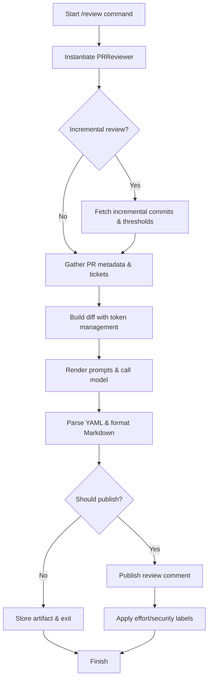

# PR Review Flow

The diagram below summarizes how the PR review command orchestrates metadata gathering, prompt preparation, model inference, and publication. Each stage links back to the core implementation in `pr_agent/tools/pr_reviewer.py`.

## Stage Details

1. **Initialization** – The reviewer resolves the git provider, detects incremental mode, derives the main language, and prepares the prompt variables and token handler used downstream.【F:pr_agent/tools/pr_reviewer.py†L35-L110】
2. **Run Guardrails** – The `run` coroutine exits early for empty PRs, failed incremental pre-checks, or skipped incremental runs before continuing to ticket extraction and optional "Preparing review" hints.【F:pr_agent/tools/pr_reviewer.py†L120-L154】
3. **Diff Preparation & Model Call** – `retry_with_fallback_models` drives `_prepare_prediction`, which gathers a context-aware diff before making a single `chat_completion` request that returns the structured review payload.【F:pr_agent/tools/pr_reviewer.py†L155-L226】
4. **Post-processing & Publication** – The YAML output is converted to Markdown, optional help text/config snippets are appended, and review labels are applied when publishing the final comment.【F:pr_agent/tools/pr_reviewer.py†L229-L415】

These steps capture the end-to-end flow from invoking the review command to posting annotated feedback and classification labels on the pull request.
